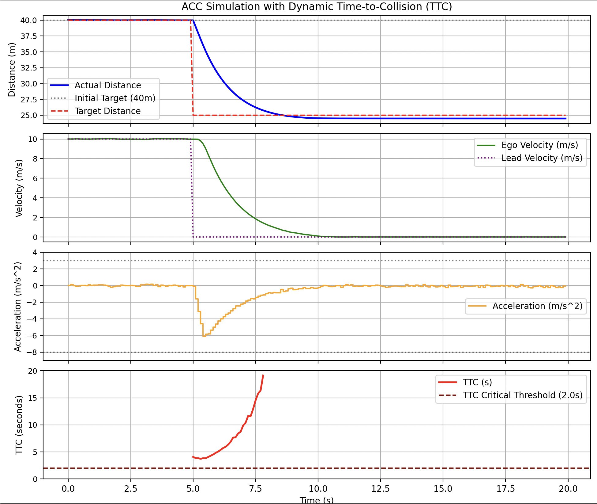

# Adaptive Cruise Control (ACC) Simulation with Physical Constraints and Sensor Noise

A C++ and Python simulation framework modeling an Adaptive Cruise Control (ACC) system. The project uses a Proportional-Derivative (PD) control loop coupled with Time-to-Collision (TTC) safety overrides, while accounting for real-world physical limitations and environmental noise.

## Overview

The simulation evaluates an ego-vehicle tracking a lead vehicle initially traveling at `10 m/s` with a stable following distance of `40 m`. At `t = 5 s`, a worst-case edge-case is triggered: the lead vehicle instantly drops to `0 m/s` (simulating an emergency stop or stationary obstacle), and the target tracking gap updates to `25 m`.

Rather than executing in an idealized mathematical bubble, the ego-vehicle operates under realistic actuator delays, jerk restrictions, and corrupted radar sensor data.

### Key Features

* **PD Control Loop with Damping:** Closed-loop regulation using tracking gap error and relative velocity damping to minimize spacing error without trailing oscillations.
* **Environmental Uncertainty (Sensor Noise):** Simulates Gaussian measurement noise on radar distance ($\sigma = 0.4\text{m}$) and velocity ($\sigma = 0.1\text{m/s}$) streams, testing controller robustness against raw signal jitter.
* **Actuator Delay Modeling:** Implements a state-buffered latency queue (`0.3 s`) mimicking the hydraulic pressure build-up time required for brake calipers to physically engage.
* **Passenger Comfort (Jerk Limiting):** Imposes a strict dynamic constraint on the rate of change of acceleration ($\pm 15.0\text{ m/s}^3$) to prevent instantaneous, physically impossible transitions.
* **Safety-Critical Override (TTC):** Continuously monitors the Time-to-Collision horizon. If the calculated TTC drops below the critical threshold of `2.0 s`, the system bypasses standard PD tracking to command an immediate maximum emergency brake.

---

## Simulation Scenario

Initial conditions:
* Target tracking distance: `40 m`
* Ground-truth tracking distance: `40 m`
* Ego vehicle velocity: `10 m/s`
* Lead vehicle velocity: `10 m/s`

Dynamic event at `t = 5 s`:
* Lead vehicle velocity steps down to `0 m/s`
* Controller target tracking distance transitions to `25 m`

---

## Simulation Results & Telemetry Analysis

The Python visualization script breaks down the system behaviors across four distinct physical properties:

1. **Distance Tracking:** Tracks the true distance converging from `40 m` smoothly to the new `25 m` baseline without under-riding or colliding.
2. **Velocity Profile:** Captures the response delay immediately following `t = 5 s` before deceleration begins, followed by a controlled deceleration profile to a full stop.
3. **Acceleration (Actuator Output):** Highlights the realistic "fuzzy" micro-adjustments during steady-state cruise caused by radar noise tracking, followed by a ramped slope during heavy braking governed strictly by the jerk limiter.
4. **Time-to-Collision (TTC):** Represents the safety margin decay. In the baseline run, the smooth jerk-limited deceleration is fast enough to keep the minimum TTC floor at ~`3.8 s`, safely avoiding the `2.0 s` emergency brake lockup trigger.



---

## Project Structure

* `src/main.cpp`: Core C++ loop hosting the physics update engine, normal noise distributions, latency buffers, and telemetry serialization.
* `scripts/plot_results.py`: Data ingestion and visualization script leveraging Matplotlib step-plots to properly display discrete actuator steps.
* `data.csv`: Telemetry log containing synced indices for `time`, `distance`, `velocity`, `lead_velocity`, `acceleration`, `setpoint`, and `ttc`.

---

## How to Run

### Prerequisites

* A C++17 compatible compiler (GCC, Clang, or MSVC)
* CMake (v3.15+)
* Python 3.x
* Required Python packages: `numpy`, `pandas`, `matplotlib`

### Step 1: Compile and Run the C++ Simulation

```bash
cmake -B out/build
cmake --build out/build
./out/build/acc_sim